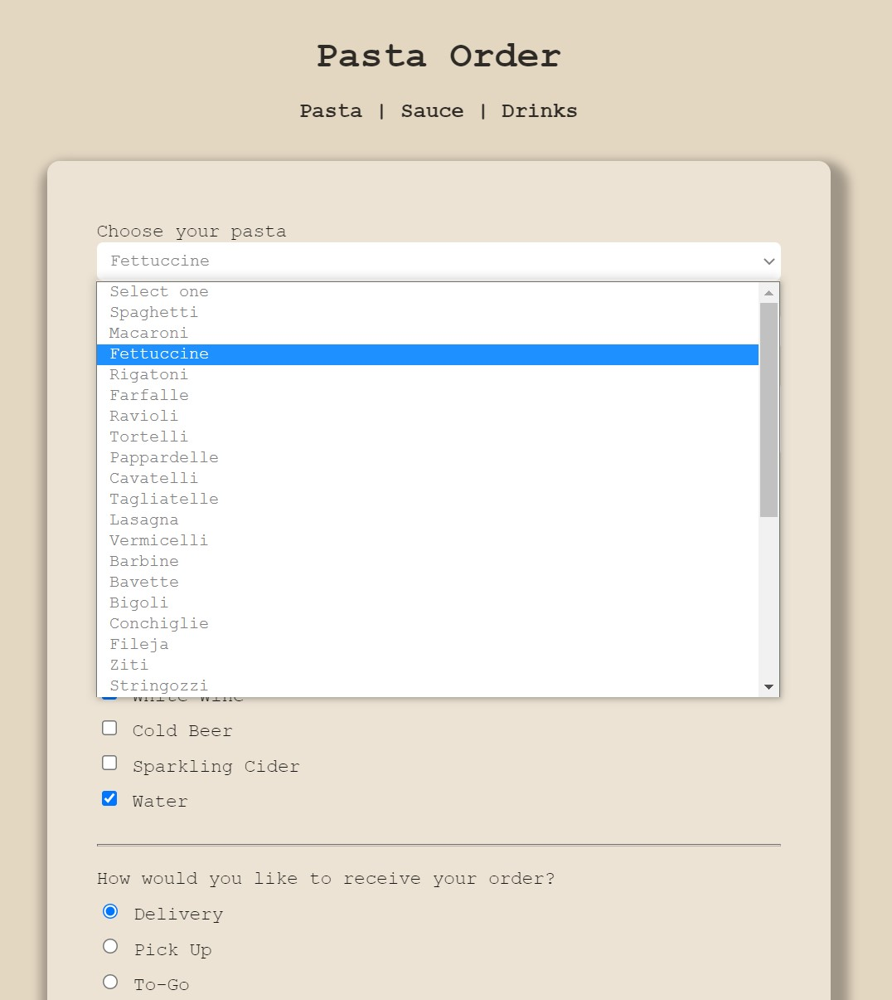

<h2 align="center">A Form To Order Pasta</h2>

    

<h3 align="center">Snapshot of Pasta Menu</h3>   

    

    <a href="https://github.com/angelptli/free-code-camp-web-dev">Back To Root README.md</a>

