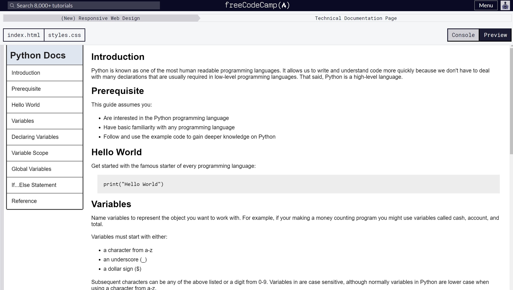

<h2 align="center">Technical Doc Page for Python Pasta</h2>

    

<h2 align="center">Snapshot of Technical Doc Page</h2>

    

 

    <a href="https://github.com/angelptli/free-code-camp-web-dev">Back To Root README.md</a>

